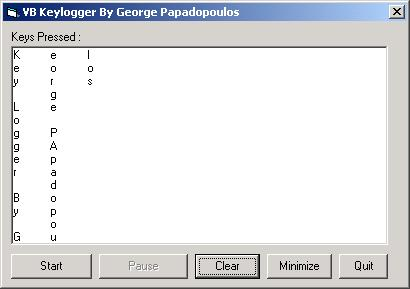



## A Great KeyLogger

### Description

VBKeylogger Is a cool program that records the keys pressed,even if the form is not visible or doesn't has focus...it records the keys even when you minimize the form or hide it or if you use another program...very nice example how to use GetAsyncKeyState...Have Fun :)
 
### More Info
 

             |
---                |---
**Submitted On**   |2001-01-07 06:38:48
**By**             |[George Papadopoulos  \- VirusFree](https://github.com/Planet-Source-Code/PSCIndex/blob/master/ByAuthor/george-papadopoulos-virusfree.md)
**Level**          |Beginner
**User Rating**    |4.4 (35 globes from 8 users)
**Compatibility**  |VB 5\.0, VB 6\.0
**Category**       |[Miscellaneous](https://github.com/Planet-Source-Code/PSCIndex/blob/master/ByCategory/miscellaneous__1-1.md)
**World**          |[Visual Basic](https://github.com/Planet-Source-Code/PSCIndex/blob/master/ByWorld/visual-basic.md)
**Archive File**   |[A\_cool\_Vb\_972766212002\.zip](https://github.com/Planet-Source-Code/george-papadopoulos-virusfree-a-great-keylogger__1-36078/archive/master.zip)

